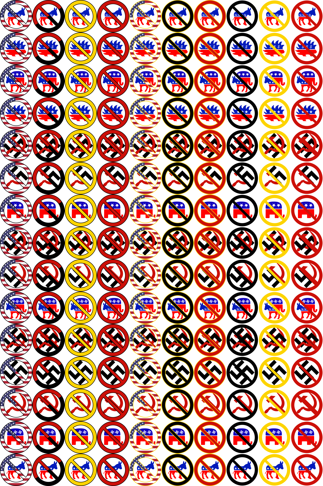

# antibuttons
A selection of public-domain political buttons/icons expressing opposition to some set of views.

It contains a non-comprehensive set of various styles and political views.  

The entire thing is public domain, and entirely sourced from public-domain art on wikipedia.  The output files, (which can be found in the [build](build) directory) contains vector svg files and png files in 512x512 and 2048x2048.  The whole set can be rebuilt from the source if you add new opposition views or styles.

A summary image of the current options can be found below.

*Note, there is a variety of political opinions expressed here to choose from, it's intentionally supposed to have something for everyone, it doesn't necessarily represent me personally, yada yada yada.*

